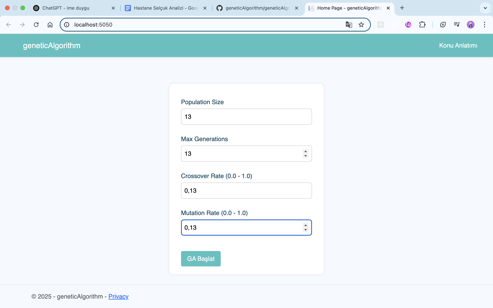
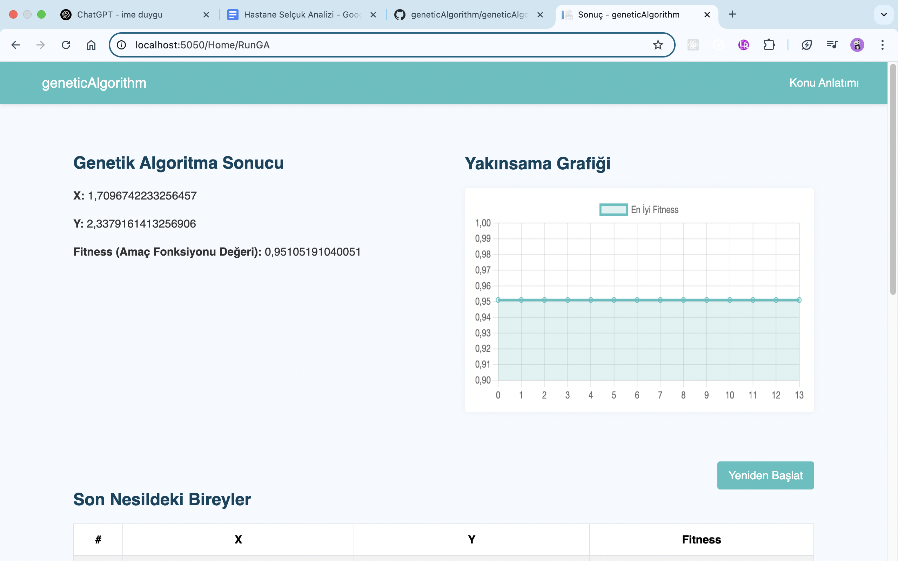

# 🧬 Genetik Algoritma ile Sürekli Fonksiyon Optimizasyonu (C# - ASP.NET Core)

Bu projede, Genetik Algoritma (GA) adımları C# diliyle sıfırdan kodlanmıştır. Kullanıcıdan alınan parametrelerle bir sürekli fonksiyonun minimumu bulunur. En iyi birey, fitness değeri ve yakınsama grafiği kullanıcıya görsel olarak sunulur.

## 📸 Uygulama Görselleri

### 🎯 Giriş Sayfası


### 📈 Sonuç ve Yakınsama Grafiği


## 🔢 Kullanılan Fonksiyon

Projede çözüm için kullanılan **amaç fonksiyonu** aşağıdaki gibidir:

f(x, y) = (x + 2y - 7)^2 + (2x + y - 5)^2


Bu fonksiyon sürekli, diferansiyellenebilir ve klasik bir optimizasyon fonksiyonu olup minimum değeri aranmaktadır.

## ⚙️ Farklı Fonksiyon Kullanmak İçin

Eğer farklı bir fonksiyon çözmek isterseniz:

1. `Services/GeneticAlgorithmService.cs` dosyasındaki `FitnessFunction` metodunu güncelleyin:

```csharp
private double FitnessFunction(double x, double y)
{
    return Math.Pow(x + 2 * y - 7, 2) + Math.Pow(2 * x + y - 5, 2);
}


double minX = -10, maxX = 10;
double minY = -10, maxY = 10;


geneticAlgorithm/
├── Controllers/
├── Models/
├── Services/
├── Views/
│   └── Home/
├── wwwroot/
│   ├── css/
│   ├── images/
│   │   ├── firsPage.png
│   │   └── resultPage.png
│   └── js/
└── README.md


